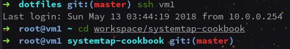

# hhktony.zsh-theme

Oh-My-ZSH prompt inspired by robbyrussell theme + ssh connection status prompt

## Screenshot



## Installation

```sh
curl --create-dirs -fLo $ZSH_CUSTOM/themes/hhktony.zsh-theme https://raw.githubusercontent.com/hhktony/hhktony.zsh-theme/master/hhktony.zsh-theme
```

And then set the theme in your `.zshrc`:

```sh
ZSH_THEME="hhktony"
```
